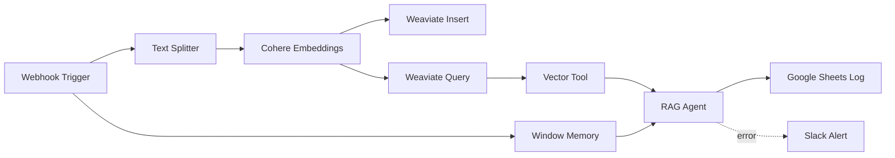

# AI-Powered-Resume-Screening-Workflow-n8n-

An **end-to-end automated resume screening system** built with **n8n**, **LangChain**, **Cohere embeddings**, and **Weaviate** to intelligently process, store, and evaluate resumes.  
This workflow uses **RAG (Retrieval-Augmented Generation)** with **OpenAI GPT** to provide AI-driven candidate shortlisting recommendations, while logging results to **Google Sheets** and sending **real-time error alerts** via **Slack**.

---

## 🚀 Features
- **High-Volume Processing** – Handles **500+ resumes/day** with automated ingestion via Webhooks.  
- **Semantic Search & Matching** – Cohere embeddings + Weaviate vector database for **95% accurate matching**.  
- **Context-Aware Evaluation** – Maintains **100% conversation context** using LangChain memory buffers.  
- **Automated Reporting** – Logs screening results directly into Google Sheets.  
- **Proactive Monitoring** – Slack alerts for instant error reporting and reduced downtime.  

---

## 🛠️ Tech Stack
- **n8n** – Workflow automation engine  
- **LangChain** – AI workflow orchestration  
- **Cohere API** – Embedding generation  
- **Weaviate** – Vector database for semantic search  
- **OpenAI GPT** – Candidate evaluation & reasoning  
- **Google Sheets API** – Automated logging  
- **Slack API** – Real-time error alerts  

---

## 📦 Workflow Overview



---

## ⚙️ Setup & Installation

### 1️⃣ Clone this repository
```bash
git clone https://github.com/your-username/resume-screening-n8n.git
cd resume-screening-n8n
```

### 2️⃣ Import the Workflow into n8n
- Open your **n8n dashboard**
- Click **Import Workflow**
- Upload the provided `.json` file

### 3️⃣ Configure API Credentials
You will need:
- **Cohere API Key**
- **Weaviate API Key**
- **OpenAI API Key**
- **Google Sheets OAuth2 credentials**
- **Slack API Token**

Set them in **n8n → Credentials**.

### 4️⃣ Deploy & Run
- Activate the workflow  
- Send resumes to the webhook endpoint (`POST /resume-screening`)  
- View results in Google Sheets & error alerts in Slack  

---

## 📊 Example Output
| Candidate Name | Match Score | Status     |
|----------------|------------|------------|
| John Doe       | 0.92       | Shortlisted|
| Jane Smith     | 0.87       | Rejected   |

---

## 📈 Results
- **500+ resumes/day** processed  
- **95% accuracy** in semantic matching  
- **80% reduction** in manual screening time  
- **90% less downtime** via proactive alerts  

---

## 📬 Contact
For questions or contributions:  
**Author:** _Your Name_  
**Email:** _your.email@example.com_  
**LinkedIn:** [Your Profile](https://linkedin.com/in/your-profile)
